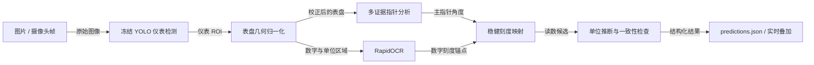

# 工业多形态指针式仪表自动读数系统

这个仓库实现了一条完整的工业指针表读数链：输入图片或摄像头帧，先定位仪表，再分析表盘、主测量指针和刻度数字，最后输出数值、单位、置信度及可审计诊断信息。

它不是“只训练一个 YOLO”的项目。YOLO 检测器只负责找到仪表；读数准确性主要来自后续的表盘几何归一化、多证据指针选择、OCR 刻度拟合、指针方向消歧和多级安全回退。

完整架构、每个程序的作用、为什么当前读数较准以及训练/评测流程，请先阅读：

- [项目完整交接与准确读数原理](docs/PROJECT_HANDOFF.md)
- [多形态仪表读数模块说明](style_reader/README.md)
- [轴心/针尖关键点训练说明](pointer_keypoints/README.md)
- [数据预标注与人工审核说明](data_premark/README.md)
- [RK3576 部署检查表](docs/deployment_checklist.md)

## 一分钟理解主流程



## 朋友克隆后如何运行

### 1. 克隆代码和 Git LFS 模型

```powershell
git lfs install
git clone https://github.com/AMarvelousJ/industrial-gauge-reader.git
cd industrial-gauge-reader
git lfs pull
```

`models/` 应包含三个主链资产：

- `meter_detector.pt`：冻结的单类仪表检测器；
- `scale_segment.pt`：第三方 MIT 指针分割模型；
- `pointer_keypoints.pt`：本项目训练的轴心/针尖模型，目前作为诊断证据。

可以先检查模型、哈希和 Python 依赖：

```powershell
python scripts\verify_setup.py
```

### 2. Windows 开发环境

项目验证环境为 Python 3.12、Windows 和 NVIDIA CUDA 12.6：

```powershell
py -3.12 -m venv .venv
.\.venv\Scripts\python.exe -m pip install --upgrade pip
.\.venv\Scripts\python.exe -m pip install -r requirements.txt
.\.venv\Scripts\python.exe -m pytest -q
```

如果没有 NVIDIA CUDA 环境，请根据自己的系统安装对应的 PyTorch，再安装 `requirements.txt` 中除 `torch/torchvision` 之外的依赖。RK3576 使用单独的 [requirements_rk3576.txt](requirements_rk3576.txt)。

### 3. 摄像头或图片目录 Demo

```powershell
# USB 摄像头
.\scripts\run_camera_demo.ps1 -Camera 0 -Width 1280 -Height 720

# 对一个图片目录逐张回放
.\scripts\run_camera_demo.ps1 -ImageDir D:\your_gauge_images
```

Linux/RK3576 入口：

```bash
bash install.sh
bash run_demo.sh --image-dir /path/to/gauge_images
```

### 4. 批量清单推理与评测

原始比赛图片和人工审核数据不在 GitHub 仓库中。准备自己的数据目录和 JSON 清单：

```json
{
  "schema_version": "1.0",
  "images": [
    {"sample_id": "demo-001", "path": "set_a/gauge_001.jpg"}
  ]
}
```

然后运行：

```powershell
.\.venv\Scripts\python.exe -m style_reader.run_manifest `
  --dataset-root D:\your_dataset `
  --image-list D:\your_dataset\images.json `
  --output-dir outputs\friend_run
```

输出包括：

- `results.json`：整批摘要和完整诊断；
- `results.jsonl`：逐图诊断记录；
- `predictions.json`：严格 1.0 预测接口；
- `visualizations/`：逐图可视化。

有独立真值时再运行 `style_reader.evaluate_readings`，不要把文件名、目录名或算法预测反推成真值。

## 当前验证状态

- 当前代码测试：129 个 pytest 全部通过。
- 已保存的 20 张人工复核闭集产物：19/20，95%，覆盖率 100%；严格 18 张口径为 17/18。
- 这只是小型闭集回归，不代表比赛要求的陌生仪表泛化率或总体 99%。
- 当前闭集剩余错误是方形电流表 RG-020 的刻度映射。
- 摄像头链已跑通，但 RapidOCR 多 pass 是主要速度瓶颈；RK3576 仍需 RKNN/NPU 和 OCR 优化。

## 数据和模型边界

- `all_set/` 是用户原始数据，仓库忽略且禁止修改。
- `runs/`、`outputs/`、`dataset/` 是本地生成产物，不上传。
- `models/meter_detector.pt` 是冻结检测器，推理时不得训练或覆盖。
- 关键点模型当前只提供诊断和一致性证据，不应在精度不足时强行接管读数。
- 任何准确率都必须同时说明真值来源、样本数、评测口径、覆盖率和是否闭集。

## 第三方说明

`third_party/Gauge-Pointer-Reading/` 及其 `scale_segment.pt` 来自 MIT 许可项目，原始许可证保留在 [third_party/Gauge-Pointer-Reading/LICENSE](third_party/Gauge-Pointer-Reading/LICENSE)。
