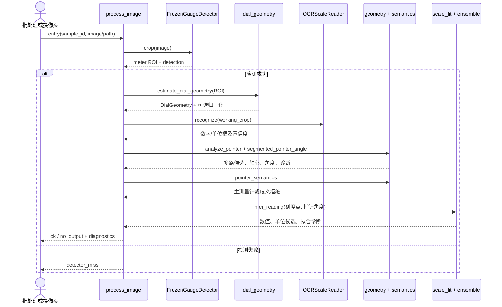
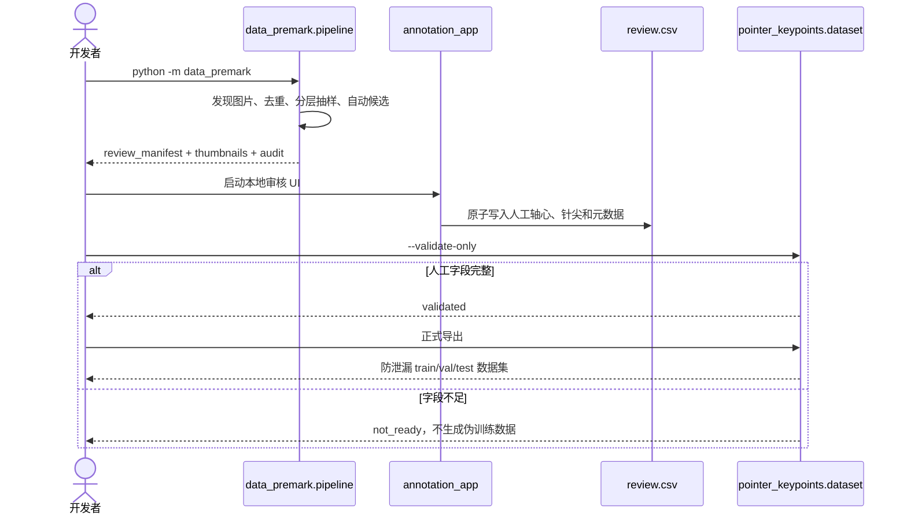

# 项目完整交接：程序作用、调用链与准确读数原理

> 仓库：`industrial-gauge-reader`
> 原始开发路径：`D:\tiaozhanbei\yolo`
> 基准提交：`5b0486d3476ce3ad8ec35a5dcf319f76b3cbff7d`，本文生成时工作区包含后续开发成果
> 分析模式：Deep，覆盖主推理、数据审核、关键点训练、离线评测和摄像头部署
> 生成日期：2026-08-27

可信度标记：

- **Verified**：已经从当前代码、测试或现有输出中直接核对。
- **Inferred**：由配置或命名强烈暗示，但没有在本轮完整运行对应设备或外部环境。
- **Unknown**：当前仓库无法证明，不能当成已完成事实。

## 1. 这个项目解决什么问题

工业现场常见压力表、温度表、差压表、电流表、电压表等机械指针仪表。巡检机器人拍到仪表后，系统需要回答四件事：

1. 仪表在哪里；
2. 哪一根线才是主测量指针；
3. 指针在刻度盘上的角度对应多少数值；
4. 这个数值的单位是什么。

本项目输入单张图片、图片目录或 USB 摄像头帧，输出 `value + unit + confidence`，并保留中间诊断证据。核心目标不是识别 M01、M03 等数据目录，而是得到可解释、可评测的真实读数。

比赛目标包含总体读数准确率、陌生仪表泛化、50 种表型、30 种品牌量程和 RK3568/RK3576 边缘部署。当前仓库只证明了一个小型闭集回归和 Windows Demo，不应把它描述成已经达到全部比赛指标。

## 2. 总体架构

```mermaid
flowchart LR
    Actor(["图片 / 摄像头 / 清单"])
    Batch["style_reader.run_manifest"]
    Camera["style_reader.demo_camera"]
    Process["process_image"]
    Detector["FrozenGaugeDetector"]
    Dial["estimate_dial_geometry"]
    OCR["OCRScaleReader"]
    Geometry["analyze_pointer"]
    Segment["segmented_pointer_angle"]
    Semantics["pointer_semantics"]
    Scale["infer_reading / scale fit"]
    Unit["infer_unit"]
    Output[("predictions.json / 实时画面")]

    Actor -->|JSON 清单| Batch
    Actor -->|BGR 帧| Camera
    Batch -->|逐图 entry| Process
    Camera -->|共享 entry| Process
    Process -->|原始图像| Detector
    Detector -->|仪表 ROI| Dial
    Dial -->|校正 ROI| OCR
    Dial -->|校正 ROI| Geometry
    Dial -->|校正 ROI| Segment
    Geometry -->|直线/红针/暗度候选| Semantics
    Segment -->|掩膜 PCA 候选| Semantics
    Semantics -->|主针角度| Scale
    OCR -->|数字刻度锚点| Scale
    Scale -->|数值候选| Unit
    Unit -->|1.0 预测记录| Output
```



高影响调用边均已从下列代码核对：

- [`style_reader/run_manifest.py::main`](../style_reader/run_manifest.py) 逐条调用 `process_image`，再写 `results.json`、`results.jsonl` 和 `predictions.json`。
- [`style_reader/demo_camera.py`](../style_reader/demo_camera.py) 将摄像头帧或图片路径包装成同一种 `entry`，复用 `process_image`。
- [`style_reader/frozen_detector.py`](../style_reader/frozen_detector.py) 只加载和调用 YOLO 检测器，没有训练入口。
- [`style_reader/ocr_mapping.py`](../style_reader/ocr_mapping.py) 把 OCR 数字变成带角度的刻度点，再调用稳健刻度拟合。

## 3. 仓库结构

```text
industrial-gauge-reader/
├── models/                    # Git LFS 模型，克隆后可直接推理
├── style_reader/              # 正式读数主链
├── pointer_keypoints/         # 轴心/针尖数据、训练、评测和推理适配
├── data_premark/              # 数据去重、预标注、审核 UI 和验收
├── style_classifier/          # 旧的 M01-M12 分组分类实验
├── scripts/                   # Windows/Linux 入口和环境检查
├── docs/                      # 设计、评测、失败分析和本交接文档
├── tests/                     # pytest 回归测试
├── third_party/               # 第三方指针分割项目及许可证
├── requirements.txt           # Windows CUDA 开发依赖
├── requirements_rk3576.txt    # RK3576 arm64 CPU 依赖
├── install.sh                 # RK3576/Linux 安装入口
└── run_demo.sh                # RK3576/Linux Demo 入口
```

不进入 Git 的目录：

- `all_set/`：用户数据，只读；
- `dataset/`：导出的训练数据；
- `runs/`：训练产物和历史权重；
- `outputs/`：审核、预测、评测和可视化结果；
- `.venv/`：本机虚拟环境。

## 4. 每个程序具体做什么

### 4.1 一键入口

| 程序 | 作用 | 输入 | 主要输出或副作用 | 地位 |
|---|---|---|---|---|
| [`scripts/run_style_reader.ps1`](../scripts/run_style_reader.ps1) | 批量读数、独立评测、生成报告 | 图片清单、数据根、模型 | `results.json`、`predictions.json`、`evaluation.json`、`report.md` | 主线 |
| [`scripts/run_camera_demo.ps1`](../scripts/run_camera_demo.ps1) | Windows 摄像头或图片目录演示 | 摄像头索引或图片目录 | OpenCV 实时窗口 | 主线 |
| [`run_demo.sh`](../run_demo.sh) | Linux/RK3576 摄像头或回放演示 | 摄像头或图片目录 | OpenCV 实时窗口 | 主线 |
| [`scripts/run_annotation_ui.ps1`](../scripts/run_annotation_ui.ps1) | 启动旧版数据审核 UI | `data_premark` 审核包 | 本地 Web UI、更新 `review.csv` | 数据链 |
| [`scripts/run_keypoint_annotation_ui.ps1`](../scripts/run_keypoint_annotation_ui.ps1) | 启动轴心/针尖审核 UI | 关键点审核包 | 本地 Web UI、原子更新 CSV | 数据链 |
| [`scripts/run_style_pipeline.ps1`](../scripts/run_style_pipeline.ps1) | 运行旧样式分类实验 | Mxx 数据和冻结检测器 | 分类模型与分类评测 | 旧实验 |
| [`install.sh`](../install.sh) | 在 Ubuntu arm64 创建环境并安装依赖 | `requirements_rk3576.txt` | `.venv/` | 部署 |
| [`scripts/check_arm_env.sh`](../scripts/check_arm_env.sh) | 检查架构、系统、Python、glibc | 当前设备 | 环境诊断文本 | 部署 |
| [`scripts/check_device.sh`](../scripts/check_device.sh) | 检查模型、依赖、摄像头 | 当前设备 | 设备诊断文本 | 部署 |
| [`scripts/verify_setup.py`](../scripts/verify_setup.py) | 检查 Python 包和三个模型 SHA256 | 当前克隆 | 可运行/不可运行结论 | 交接验证 |

### 4.2 正式读数模块 `style_reader/`

| 文件 | 具体职责 |
|---|---|
| [`run_manifest.py`](../style_reader/run_manifest.py) | 中央编排器。加载清单和模型，逐图执行完整算法，统一坐标系，选择指针，映射读数，推断单位并写预测协议。 |
| [`frozen_detector.py`](../style_reader/frozen_detector.py) | 加载冻结 YOLO，取置信度最高的 `meter` 框，增加少量 padding 后裁出仪表。 |
| [`dial_geometry.py`](../style_reader/dial_geometry.py) | 判断正视圆、透视椭圆、矩形扇区或 ROI 回退；仅在证据充分时做仿射或单应归一化。 |
| [`geometry.py`](../style_reader/geometry.py) | 估计表盘圆；产生 Hough 直线、径向暗度、红色细长目标和刻度暗峰候选。 |
| [`pointer_semantics.py`](../style_reader/pointer_semantics.py) | 把候选标成测量针、分离标记、未附着结构等角色；综合长度、轴心连接、方法置信度和冲突关系选主针。 |
| [`ocr_mapping.py`](../style_reader/ocr_mapping.py) | RapidOCR 多 pass；清洗数字；将 OCR 框中心转成角度；生成刻度点并推断读数。 |
| [`scale_fit.py`](../style_reader/scale_fit.py) | 清理异常锚点、稳健拟合单/双刻度、检查单调性、计算插值或外推和置信度。 |
| [`tick_mapping.py`](../style_reader/tick_mapping.py) | 尝试把印刷数字吸附到实际刻度线；目前保留诊断，未满足可信条件时不覆盖正式读数。 |
| [`scale_mapping_ensemble.py`](../style_reader/scale_mapping_ensemble.py) | 协调全局稳健拟合和局部锚点插值；只在局部方案可证明更安全时替换。 |
| [`meter_family.py`](../style_reader/meter_family.py) | 根据表盘形状、OCR 名牌、色区和掩膜轴心位置判断仪表家族，作为路由或诊断元数据。 |
| [`unit_inference.py`](../style_reader/unit_inference.py) | 综合 OCR 单位文本、仪表家族和刻度范围推断单位；低置信时宁可不输出。 |
| [`evaluate_readings.py`](../style_reader/evaluate_readings.py) | 与独立真值比较，完成单位换算、覆盖率、正确率和逐样本失败诊断。 |
| [`build_report.py`](../style_reader/build_report.py) | 把预测和评测结果整理成 Markdown 报告及接触表。 |
| [`demo_camera.py`](../style_reader/demo_camera.py) | 捕获摄像头帧或图片回放，周期性调用共享 `process_image`，把读数、框、指针线和耗时叠到画面。 |
| [`evaluate_third_party_segmentation.py`](../style_reader/evaluate_third_party_segmentation.py) | 单独审计第三方分割器，不改变主检测器或训练它。 |

### 4.3 关键点模块 `pointer_keypoints/`

| 文件 | 具体职责 |
|---|---|
| [`contract.py`](../pointer_keypoints/contract.py) | 定义两个关键点的顺序、坐标、状态、角度和拒绝原因。 |
| [`review_package.py`](../pointer_keypoints/review_package.py) | 从预标注结果构建目标样本和备用样本审核队列。 |
| [`prefill_review_metadata.py`](../pointer_keypoints/prefill_review_metadata.py) | 预填可确定的元数据，减少人工重复录入；不伪造轴心或针尖真值。 |
| [`dataset.py`](../pointer_keypoints/dataset.py) | 校验人工字段，按物理表、来源、重复簇、品牌型号防泄漏拆分，导出 YOLO Pose 数据集。 |
| [`train.py`](../pointer_keypoints/train.py) | 用固定参数训练 YOLOv8 Pose，并拒绝覆盖已有运行目录。 |
| [`evaluate.py`](../pointer_keypoints/evaluate.py) | 在验证集校准置信度阈值，在冻结测试集计算轴心、针尖和角度误差。 |
| [`inference.py`](../pointer_keypoints/inference.py) | 加载姿态模型；检查置信度、越界和指针长度；输出可接受或拒绝的关键点估计。 |

### 4.4 数据审核模块 `data_premark/`

| 文件 | 具体职责 |
|---|---|
| [`__main__.py`](../data_premark/__main__.py) | `python -m data_premark` 命令入口。 |
| [`pipeline.py`](../data_premark/pipeline.py) | 发现图片、读取已有框、感知哈希去重、自动几何候选、分层抽样并生成审核包。 |
| [`annotation_app.py`](../data_premark/annotation_app.py) | 仅监听本机的审核服务；校验 record ID；通过临时文件和原子替换更新 CSV。 |
| [`annotation_ui/`](../data_premark/annotation_ui/) | 浏览器端点击轴心、拖动针尖、填写元数据的静态 UI。 |
| [`review_acceptance.py`](../data_premark/review_acceptance.py) | 检查人工审核完整度；没有足够真值时返回 `not_ready`，不会计算伪指标。 |
| [`schemas/preannotation.schema.json`](../data_premark/schemas/preannotation.schema.json) | 固定预标注和审核记录的数据协议。 |

### 4.5 旧样式分类与检测脚本

| 文件 | 具体职责 | 注意 |
|---|---|---|
| [`style_classifier/train.py`](../style_classifier/train.py) | 微调 ResNet18，将 M01-M12 当作训练类别。 | Mxx 更像来源批次，不是可靠表型；当前读数主链不用。 |
| [`style_classifier/predict_manifest.py`](../style_classifier/predict_manifest.py) | 用冻结检测器裁图后做样式分类。 | 只用于历史实验。 |
| [`style_classifier/evaluate.py`](../style_classifier/evaluate.py) | 统计闭集分类准确率和宏召回。 | 不能当读数准确率。 |
| [`scripts/prepare_dataset.py`](../scripts/prepare_dataset.py) | 为单类 `meter` 检测器准备数据清单。 | 会写 `dataset/`，不修改 `all_set/`。 |
| [`scripts/train_detector.py`](../scripts/train_detector.py) | 训练统一 `meter` 检测器。 | 当前正式检测器被冻结，不应覆盖它。 |
| [`scripts/predict_crop.py`](../scripts/predict_crop.py) | 用检测器预测并导出裁剪结果。 | 调试或旧工具。 |

## 5. 主推理的真实时序



### 逐步解释

1. **加载输入但不加载真值**：`load_image_list` 只使用 `sample_id` 和相对图片路径。读数 Markdown 不进入算法。
2. **冻结检测**：`FrozenGaugeDetector.crop` 在原图上运行单类 YOLO，只返回最高置信表框；检测失败被明确记录。
3. **表盘几何**：`estimate_dial_geometry` 估计圆、椭圆、矩形边界。`normalization_policy` 只在透视或矩形证据足够时校正，避免破坏正视圆表。
4. **OCR 与坐标统一**：先在源 ROI 识别文字，再在需要时将 OCR 框变换到规范坐标；超长数字串会被过滤，避免铭牌或序列号污染刻度拟合。
5. **生成多路指针证据**：Hough 直线找细长边缘，HSV 找红针，径向暗度扫描找从轴心向外的暗线，分割掩膜用 PCA 给出方向和自身轴心。
6. **选择主测量针**：`pointer_semantics` 根据轴心连接、长度、候选来源和互相冲突情况打分；红色设定标记、边框线和分离结构不会仅因显眼就获胜。
7. **轴心覆盖**：方形或盒式表的真实 hub 可能远离拟合圆心。分割掩膜的 `pca_pivot` 足够可信时，指针角度和 OCR 刻度角统一从这个 hub 计算。
8. **刻度拟合**：OCR 数字变成 `(angle, value, confidence)` 锚点；稳健拟合去除异常点并检查单调性，最多支持两套刻度。
9. **映射集成**：全局稳健拟合与局部锚点插值同时计算。局部插值不外推；二者冲突时保留已验证路径并标记不确定。
10. **针尖方向消歧**：PCA 轴天然有 180° 二义性。系统结合红针端点、掩膜端点和数字刻度角包络投票，只有相反方向证据明显更强才翻转。
11. **单位推断**：优先 OCR 显式单位，其次用仪表家族和刻度范围；置信度太低则输出 `no_output`，避免“有数字但单位错”。
12. **写出可审计结果**：每张图保留检测框、几何类型、所有指针候选、选中理由、OCR 锚点、拟合方法、回退路径和阶段耗时。

## 6. 为什么这套流程读数比较准

准确不是来自某一个神奇模型，而是来自以下约束叠加。

### 6.1 先把检测问题与读数问题分开

检测器只有一个 `meter` 类，任务只是稳定裁出仪表。它不会把 M01-M12 样式、图片路径或人工读数泄漏到推理输入。检测权重被冻结，因此后续读数实验不会意外改变定位基线。

这使错误能被分层定位：`detector_miss` 是定位问题；有 ROI 但无角度是指针问题；有角度但无数值是 OCR 或映射问题。

### 6.2 几何校正有门槛，而不是默认拉伸所有图片

正视圆表已经接近理想坐标，错误的透视变换反而会移动轴心和刻度。当前代码只有在轴比、边界误差和置信度满足策略时才应用归一化，并记录 `normalization.reason`。

### 6.3 指针不是单算法识别，而是证据融合

不同表型的最佳证据不同：

- 黑色细针通常适合 Hough 和径向暗度；
- 红色主针适合 HSV，但红色设定标记也可能造成误判；
- 低对比或盒式表适合分割掩膜 PCA；
- 关键点模型提供轴心或针尖一致性诊断。

多路候选先保留，再由语义层选择，因此某一路偶尔失败时还有回退，而不是直接产生完全错误的读数。

### 6.4 “哪一根是针”和“针指向哪里”分开解决

系统不仅比较候选角度，还检查候选是否连接轴心、长度是否合理、是否更像边框或分离标记。选中主轴后，又单独处理 180° 端向问题。把这两个问题分开能避免“线找对了但针尖方向反了”。

### 6.5 方形或盒式表使用真实 hub

圆形 Hough 拟合得到的是外观圆心，不一定是机械旋转轴心。对于差压表和方形表，分割掩膜自身的 PCA hub 与拟合圆心偏差明显时，代码会统一改用 mask hub 计算指针角和刻度锚点角。统一坐标原点是此类表读准的前提。

### 6.6 OCR 结果进入物理约束，而不是直接相信文字

OCR 会多方向、多图像变体识别，但只有通过数字格式、置信度、位置和半径带检查的结果才进入刻度拟合。铭牌序列号、品牌文字和异常长数字会被剔除。OCR 负责提供锚点，不直接决定最终读数。

### 6.7 刻度拟合要求单调、可解释、可回退

刻度数字被转换为角度—数值点后，系统用稳健方法处理异常 OCR，并检查刻度是否单调。双刻度表最多拆成两套模型。局部插值只有在指针被两个可信锚点包围时可用，不允许盲目外推。

### 6.8 宁可拒绝，也不伪造确定性

以下情况会明确降低置信度、回退或输出 `no_output`：

- 检测不到仪表；
- 主指针候选接近且角度冲突；
- 关键点低置信、越界或长度异常；
- OCR 锚点不足或不单调；
- 单位无法可靠确定；
- 两种刻度映射严重不一致。

对工业读表来说，可解释的拒识通常比高覆盖率下的无提示错误更安全。

### 6.9 真值和算法严格分离

`ground_truth_used_by_algorithm=false` 被写入结果。正式评测器单独读取真值，先验证预测协议，再换算单位并计算误差。文件路径、Mxx 目录和 Markdown 读数不能作为推理特征。

## 7. 数据准备与人工审核流程



命令：

```powershell
# 生成预标注和审核包
.\.venv\Scripts\python.exe -m data_premark `
  --source all_set `
  --output outputs\data_premark_v1

# 生成关键点审核队列
.\.venv\Scripts\python.exe -m pointer_keypoints.review_package

# 启动关键点审核 UI
.\scripts\run_keypoint_annotation_ui.ps1

# 只校验，不导出
.\.venv\Scripts\python.exe -m pointer_keypoints.dataset `
  --review-csv outputs\pointer_keypoint_review_v1\review.csv `
  --manifest outputs\pointer_keypoint_review_v1\review_manifest.json `
  --validate-only
```

防泄漏拆分不是随机按图片分行，而是将同一物理仪表、来源组、重复簇以及相同品牌型号连接成组，整组只能进入 train、val、test 中一个集合。增强只施加到训练集。

## 8. 关键点训练与评测流程


命令：

```powershell
.\.venv\Scripts\python.exe -m pointer_keypoints.train

.\.venv\Scripts\python.exe -m pointer_keypoints.evaluate `
  --weights runs\pointer_keypoints\industrial_single_pointer_v1\weights\best.pt `
  --split val --calibrate `
  --output outputs\pointer_keypoints\val_calibration.json

.\.venv\Scripts\python.exe -m pointer_keypoints.evaluate `
  --weights runs\pointer_keypoints\industrial_single_pointer_v1\weights\best.pt `
  --split test `
  --threshold-file outputs\pointer_keypoints\val_calibration.json `
  --output outputs\pointer_keypoints\frozen_test.json
```

当前共享的 `models/pointer_keypoints.pt` 仍然是诊断模型。低置信、越界或长度异常会回退传统几何；即使关键点被接受，正式读数中心也不会无条件被它替换。

## 9. 评测口径和现有结果

### Verified

- 当前 pytest：129 项全部通过。
- 最新保存的 `tc2b_v16/predictions.json` 对独立 20 张真值重新计算：19/20，覆盖率 100%。
- 严格 18 张子集：17/18。
- 唯一错误：RG-020，真值 `26 A`，预测约 `38.143 A`，允许误差 `2.5 A`。
- M01 164 张批量运行：检测 164、角度 160、完整读数 140；没有独立读数真值，所以不能计算准确率。

### 不能扩大解释

- 20 张是小型闭集回归，不等于陌生表型泛化。
- 训练或审核数据不能证明 50 种真实物理表或 30 种品牌覆盖。
- 当前没有 RK3576 上的 100 次时延、功耗和温度实测。
- Windows 摄像头有表帧的主要瓶颈是 RapidOCR 多 pass，约 2–16 秒，尚未达到端侧实时指标。

## 10. 输出协议

`predictions.json` 顶层：

```json
{
  "schema_version": "1.0",
  "predictions": []
}
```

单条成功预测：

```json
{
  "sample_id": "demo-001",
  "status": "ok",
  "value": 0.41,
  "unit": "MPa",
  "confidence": 0.82,
  "source_path": "set_a/gauge_001.jpg",
  "diagnostics": {
    "detector": {},
    "geometry": {}
  }
}
```

`status` 只有三类：

- `ok`：数值和单位都可用；
- `detector_miss`：没有定位到仪表；
- `no_output`：定位成功，但指针、刻度映射或单位证据不足。

## 11. 朋友最建议的阅读顺序

1. 本文档，先建立全局模型。
2. [`style_reader/run_manifest.py::process_image`](../style_reader/run_manifest.py)，看完整编排。
3. [`style_reader/frozen_detector.py`](../style_reader/frozen_detector.py)，看输入如何变成仪表 ROI。
4. [`style_reader/dial_geometry.py`](../style_reader/dial_geometry.py)，理解坐标归一化。
5. [`style_reader/geometry.py`](../style_reader/geometry.py)，看候选指针怎样产生。
6. [`style_reader/pointer_semantics.py`](../style_reader/pointer_semantics.py)，看主针为什么被选中。
7. [`style_reader/ocr_mapping.py`](../style_reader/ocr_mapping.py) 和 [`scale_fit.py`](../style_reader/scale_fit.py)，理解角度如何变成数值。
8. [`style_reader/demo_camera.py`](../style_reader/demo_camera.py)，看如何复用单图主链。
9. [`style_reader/evaluate_readings.py`](../style_reader/evaluate_readings.py)，理解准确率口径。
10. `data_premark/` 和 `pointer_keypoints/`，最后再看数据生产与训练。

## 12. 高影响证据与不确定项

| 结论 | 代码或产物证据 | 状态 | 说明 |
|---|---|---|---|
| 摄像头和批处理共享同一算法 | `demo_camera.py -> process_image` | Verified | 避免两套逻辑漂移 |
| 检测器在读数阶段被冻结 | `FrozenGaugeDetector` 只有 `predict/crop` | Verified | 训练脚本独立存在 |
| 真值不进入推理 | `load_image_list` 和结果字段 | Verified | 评测器另行读取真值 |
| 多路指针证据进入语义选择 | `analyze_pointer`、`segmented_pointer_angle`、`pointer_semantics` | Verified | 候选及理由写入诊断 |
| tick 映射当前不直接接管 | `trusted_for_reading = False` | Verified | 证据未完全验证前保持影子模式 |
| 关键点当前不直接接管读数中心 | `diagnostic_keypoint_pivot` 分支 | Verified | 防止未达标模型造成回归 |
| 20 张闭集为 19/20 | `tc2b_v16` 预测和独立评测器 | Verified | 不是泛化结果 |
| RK3576 可完整跑在 300 ms 内 | 无设备完整实测 | Unknown | 需要 RKNN/NPU 与 OCR 优化后实测 |
| 企业现场陌生表泛化达到 95% | 无企业独立真值 | Unknown | 当前不能宣称 |

本文没有穷举所有内部辅助函数；它覆盖的是朋友理解、运行、比较实现方式和继续开发所需的主入口、主数据流和关键安全边界。
